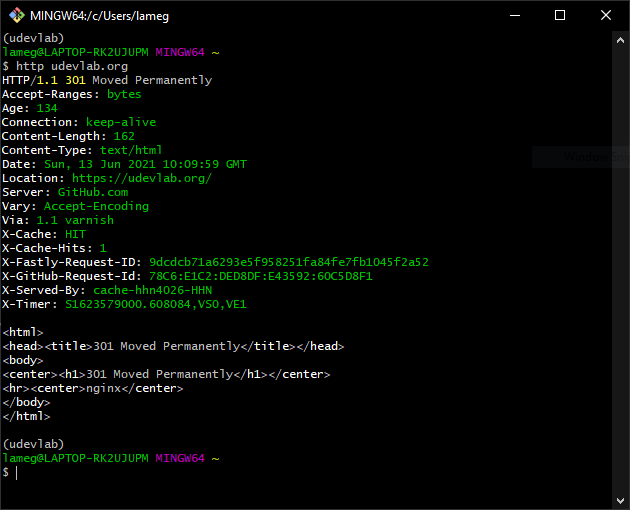
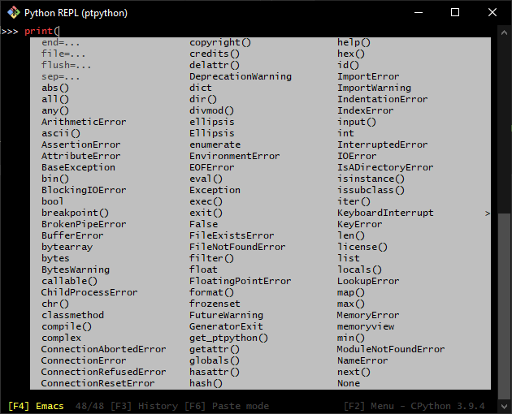
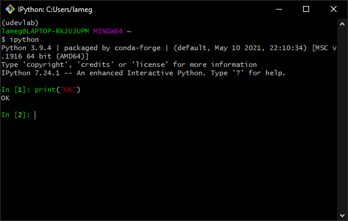

The User Development Lab project provides documentation and tools to help to setup an opensource based development environment for Windows, without requiring admin privileges.


Open a Windows Command Prompt and run the following command:
```sh
curl -s https://udevlab.org/setup.ps1 | powershell -
```

## Features

- [x] VSCode preconfigured to use GitBash
- [x] GitBash configured to be used Miniconda
- [x] Some developer friend utilites like httpie and ptpython


Using [httpie]:
[httpie]: https://httpie.io/



Using [ptpython] console:

[ptpython]: https://github.com/prompt-toolkit/ptpython



Using the [ipython]: console:

[ipython]: https://ipython.org/

